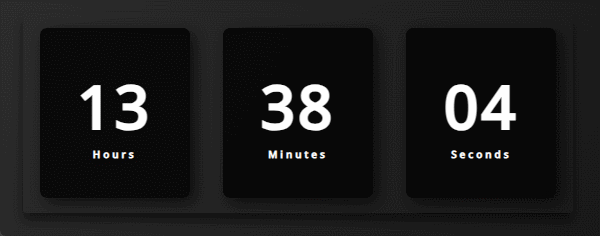

<h1 align="center">

<p>What time is it? ⏰</p>
</h1>

<h2 align="center"> </h2>

## 📕 About

**Digital Clock** is a simple project to show the exact hours, minutes, and seconds.

## ⚒️ Tools
- 
- 
- 

## ⏰ How To Use

```bash
    Open the 'index.html' file on your browser or live server.
```
